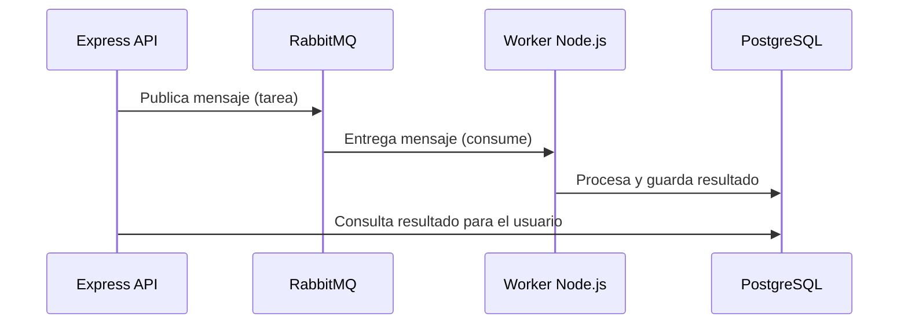

# 🧠 Study Path AI API

Backend para una plataforma de aprendizaje inteligente que genera rutas de estudio personalizadas, quizzes autogenerados, gamificación y búsqueda semántica.  
**Stack:** Express.js, TypeScript, RabbitMQ, PostgreSQL + pgvector, Docker.

---

## 🚀 Tecnologías Principales

- **Express.js**: API REST principal.
- **TypeScript**: Tipado estático y desarrollo moderno.
- **RabbitMQ**: Broker de mensajes para tareas asíncronas.
- **PostgreSQL + pgvector**: Base de datos relacional y búsqueda semántica.
- **Docker & Docker Compose**: Entorno reproducible y fácil de levantar.
- **amqplib**: Cliente Node para RabbitMQ.
- **OpenAI / Gemini / Groq**: Integración con modelos de IA.

---

## 📦 Arquitectura General

El sistema desacopla la API de las tareas pesadas usando RabbitMQ y workers.  
**Flujo resumido:**

```mermaid
graph TD
    A[Usuario] -->|HTTP Request| B(API Express)
    B -->|Publica tarea| C(RabbitMQ Exchange)
    C --> D(Queue: task_queue)
    E(Worker) -->|Consume tarea| D
    E -->|Procesa| F[Gemini/Groq/DB]
    F -->|Guarda resultado| G[PostgreSQL + pgvector]
    B <--|Consulta resultado| G
```

---

## 🗂️ Estructura del Proyecto

```
├── api/                # Lógica de la API Express
│   ├── controllers/
│   ├── routes/
│   └── server.ts
├── config/             # Configuración (RabbitMQ, etc.)
├── services/           # Lógica de negocio y workers
├── scripts/            # Scripts utilitarios (ej. embeddings)
├── utils/              # Helpers y utilidades
├── db.ts               # Conexión a la base de datos
├── docker-compose.yml  # Orquestación de servicios
├── .env.example        # Variables de entorno
├── tsconfig.json       # Configuración TypeScript
└── README.md
```

---

## 🐇 Flujo de RabbitMQ



- **Exchange:** `task_exchange`
- **Queue:** `task_queue`
- **Routing Key:** `task_routing_key`
- **Config:** Ver `config/rabbitmq.config.ts`

---

## 🛠️ Instalación y Uso

### 1. Prerrequisitos

- Docker y Docker Compose
- Node.js v18+
- npm

### 2. Configuración

1. Clona el repositorio:
   ```bash
   git clone <repo-url>
   cd <nombre-del-proyecto>
   ```
2. Copia `.env.example` a `.env` y completa las variables necesarias.
3. Instala dependencias:
   ```bash
   npm install
   ```

### 3. Levantar el entorno

1. Inicia los servicios con Docker:

   ```bash
   docker-compose up -d --build
   ```

   - Levanta PostgreSQL (con pgvector) y RabbitMQ (con UI de gestión).

2. Inicia la API en modo desarrollo:

   ```bash
   npm run dev
   ```

3. (Opcional) Genera embeddings para búsqueda semántica:
   ```bash
   npm run generate-embeddings
   ```

---

## 🧩 Endpoints de la API

| Método | Endpoint                      | Descripción                                                 | Body / Parámetros                                            |
| :------- | :---------------------------- | :---------------------------------------------------------- | :----------------------------------------------------------- |
| `POST`   | `/study-path`                 | Encola una tarea para generar una nueva ruta de estudio.    | `Body: { "topic": "string" }`                                |
| `GET`    | `/study-path/:id`             | Obtiene los módulos de una ruta de estudio específica.      | `Parámetro: id` (ID de la ruta)                              |
| `GET`    | `/study-path-modules/:id`     | Obtiene un módulo de estudio específico.                    | `Parámetro: id` (ID del módulo)                              |
| `POST`   | `/generate-images-for-path`   | Genera las imágenes para todos los módulos de una ruta.     | `Body: { "studyPathId": "number" }`                          |
| `POST`   | `/agent`                      | Interactúa con el agente inteligente para tareas y recom.   | `Body: { "prompt": "string" }`                               |
| `POST`   | `/text-to-speech`             | Convierte un texto a voz.                                   | `Body: { "text": "string" }`                                 |
| `POST`   | `/modules/complete`           | Marca un módulo como completado y otorga logros.            | `Body: { "userId": "number", "moduleId": "number" }`         |
| `GET`    | `/users/:userId/progress`     | Obtiene el progreso de un usuario (módulos y logros).       | `Parámetro: userId`                                          |
| `GET`    | `/users/:userId/dashboard`    | Obtiene un resumen del dashboard de un usuario.             | `Parámetro: userId`                                          |
| `GET`    | `/modules/:moduleId/quiz`     | Genera un nuevo quiz para un módulo.                        | `Parámetro: moduleId`                                        |
| `POST`   | `/quizzes/:quizId/submit`     | Envía las respuestas de un quiz y obtiene el resultado.     | `Parámetro: quizId`, `Body: { "userId": "number", "answers": [{ "questionId": "number", "selectedOptionIndex": "number" }] }` |
| `GET`    | `/users/:userId/performance`  | Obtiene el historial de rendimiento en quizzes de un usuario. | `Parámetro: userId`                                          |
| `GET`    | `/search`                     | Realiza una búsqueda semántica en los módulos.              | `Query: ?q=tu-busqueda`                                      |
| `GET`    | `/health`                     | Verifica el estado de salud de la API.                      | N/A                                                          |

---

## 🗺️ Roadmap

- [ ] Refactorizar workers para tareas pesadas (rutas, imágenes, quizzes).
- [ ] Notificaciones en tiempo real (WebSockets).
- [ ] Mejorar seguridad y validaciones.
- [ ] Documentar endpoints con Swagger.

---

## 📝 Notas para Desarrolladores Nuevos

- **RabbitMQ** se usa para desacoplar la API de las tareas pesadas. Consulta y modifica la configuración en `config/rabbitmq.config.ts`.
- **pgvector** permite búsquedas semánticas avanzadas en PostgreSQL.
- **Docker Compose** facilita levantar todo el entorno con un solo comando.
- **TypeScript** mejora la mantenibilidad y escalabilidad del código.

---

¿Dudas? Revisa los archivos de configuración y scripts, y consulta este README para entender el flujo y cómo contribuir.
