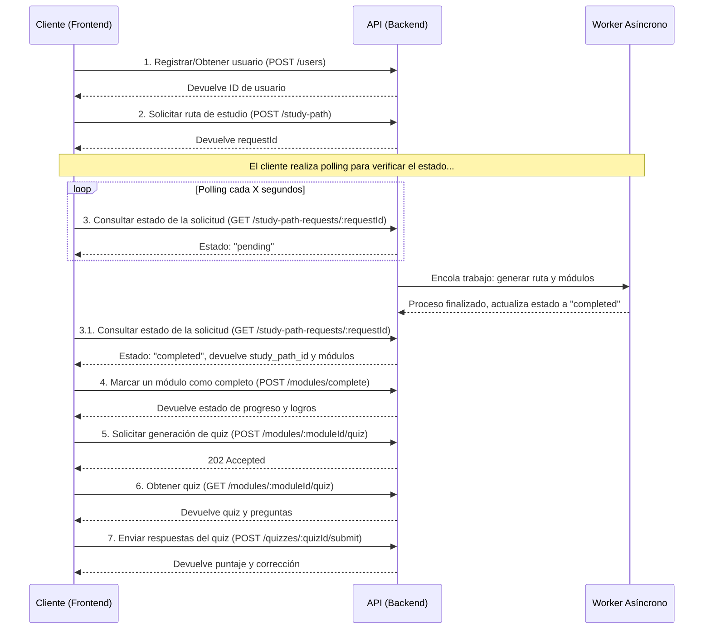

# Flujo de la Aplicación y Consumo de Endpoints

Este documento describe el flujo de interacción recomendado para un cliente que consume la API de Ritmo, detallando el orden en que se deben llamar los endpoints y la lógica de negocio asociada.

> **Nota de versionado**: Las secciones siguientes corresponden a la **Fase 1** del MVP. Cada vez que incorporemos nuevos endpoints o vistas de la **Fase 2 en adelante**, documentaremos el flujo actualizado en un apartado propio para que el equipo de frontend pueda sincronizar sus entregas por fase.

## Diagrama General del Flujo de Usuario

A continuación, se presenta un diagrama de secuencia que ilustra el viaje principal del usuario en la aplicación, desde el registro hasta completar un módulo de estudio.

## Flujos Detallados y Endpoints

### 1. Onboarding del Usuario

El primer paso es registrar al usuario para obtener un `userId` que se usará en todas las peticiones posteriores.

- **`POST /users`**: Registra un nuevo usuario o recupera uno existente.

  - **Petición**: `{ "username": "nombre_de_usuario" }`
  - **Respuesta Exitosa (`200 OK` o `201 Created`)**: `{ "id": 1, "username": "nombre_de_usuario", ... }`
  - **Uso**: Guardar el `id` en el cliente para futuras llamadas.

- **`GET /users/:userId`**: Obtiene la información de un usuario.
  - **Uso**: Para verificar datos del usuario si es necesario.

### 2. Creación de Ruta de Estudio (Asíncrono)

El usuario solicita una ruta de estudio sobre un tema de interés. Este es un proceso asíncrono.

- **`POST /study-path`**: Inicia la generación de la ruta.

  - **Petición**: `{ "topic": "Aprender sobre IA", "userId": 1 }`
  - **Respuesta Exitosa (`202 Accepted`)**: `{ "message": "...", "requestId": "uuid-..." }`
  - **Flujo**:
    1. El cliente envía el `topic` y `userId`.
    2. El servidor encola un trabajo de generación y devuelve un `requestId`.
    3. El cliente **debe** usar este `requestId` para consultar el estado del proceso.

- **`GET /study-path-requests/:requestId`**: Consulta el estado de la solicitud.
  - **Uso (Polling)**: El cliente debe llamar a este endpoint periódicamente (ej. cada 5-10 segundos) hasta que el estado cambie de `pending` a `completed`.
  - **Respuesta en progreso**: `{ "request": { "status": "pending", ... } }`
  - **Respuesta finalizada**: `{ "request": { "status": "completed", "study_path_id": 123, ... }, "modules": [...] }`
    - Cuando el estado es `completed`, la respuesta incluye los módulos de estudio. El cliente ya puede mostrar la ruta al usuario.

### 3. Visualización de Contenido

Una vez que una ruta de estudio está creada, el cliente puede obtener la lista de rutas y los detalles de cada una.

- **`GET /study-paths?userId=:userId`**: Lista todas las rutas de estudio de un usuario.
- **`GET /study-path/:id`**: Obtiene los módulos de una ruta de estudio específica.
- **`GET /study-path-modules/:id`**: Obtiene la información de un módulo puntual.

### 4. Progreso y Gamificación

El cliente notifica al backend cuando un usuario completa un módulo.

- **`POST /modules/complete`**: Marca un módulo como completado.

  - **Petición**: `{ "userId": 1, "moduleId": 23 }`
  - **Respuesta Exitosa (`201 Created`)**: `{ "progress": {...}, "achievements": [...] }`
  - **Uso**: Permite al backend registrar el avance y otorgar logros.

- **`GET /users/:userId/progress`**: Devuelve el progreso general del usuario, incluyendo módulos completados y logros.

### 5. Evaluaciones (Quizzes)

Para cada módulo, el cliente puede solicitar la generación de un quiz y luego permitir al usuario tomarlo.

- **`POST /modules/:moduleId/quiz`**: Solicita la generación de un quiz para un módulo. Es un proceso asíncrono.

  - **Respuesta (`202 Accepted`)**: Indica que el trabajo fue encolado.

- **`GET /modules/:moduleId/quiz`**: Obtiene el quiz generado.

  - **Uso**: El cliente puede hacer polling a este endpoint o simplemente intentar obtenerlo cuando el usuario quiera realizar el quiz.
  - **Respuesta Exitosa (`200 OK`)**: `{ "quiz": {...}, "questions": [...] }`
  - **Respuesta si no existe (`404 Not Found`)**: Indica que el quiz aún no está listo.

- **`POST /quizzes/:quizId/submit`**: Envía las respuestas del usuario.

  - **Petición**: `{ "userId": 1, "answers": [{ "questionId": 10, "selectedOptionIndex": 2 }] }`
  - **Respuesta (`200 OK`)**: `{ "attemptId": 45, "score": 85.5, "corrections": [...] }`

- **`GET /users/:userId/performance`**: **(NUEVO)** Obtiene el rendimiento histórico del usuario en los quizzes.

### 6. Funcionalidades Adicionales

#### Búsqueda

- **`GET /search?q=texto`**: Búsqueda semántica en todos los módulos.
- **`GET /search/typesense?q=texto`**: Búsqueda por palabras clave usando Typesense.

#### Texto a Voz (TTS)

- **`POST /text-to-speech`**: Inicia la conversión de texto a voz para un módulo (asíncrono).

  - **Petición**: `{ "text": "...", "userId": 1, "moduleId": 23 }`
  - **Respuesta (`202 Accepted`)**: `{ "jobId": "uuid-..." }`

- **`GET /text-to-speech/:jobId`**: Consulta el estado del trabajo de TTS (requiere polling).
- **`GET /text-to-speech`**: Lista los trabajos de TTS de un usuario.

#### Agente IA

- **`POST /agent`**: Envía un prompt al agente de IA para obtener recomendaciones o ejecutar tareas.
  - **Petición**: `{ "prompt": "¿Qué me recomiendas estudiar hoy?" }`
  - **Respuesta**: Puede ser texto directo (`{ "text": "..." }`) o el resultado de una herramienta (`{ "toolResult": {...} }`).

##### Herramientas del Agente

Cuando el agente necesita interactuar con el sistema para cumplir una solicitud, utiliza las siguientes herramientas. El frontend puede usar esta información para entender qué capacidades tiene el agente.

- **`add_task`**: Añade una nueva tarea a la lista del usuario.

  - **Argumentos**: `{ "task": "Descripción de la tarea" }` (string)

- **`get_tasks`**: Obtiene la lista de tareas del usuario.

  - **Argumentos**: `{ "status": "pending" }` (string, opcional). Puede ser "pending", "completed", etc. Si se omite, devuelve todas las tareas.

- **`update_task_status`**: Actualiza el estado de una tarea existente.

  - **Argumentos**: `{ "taskId": 123, "status": "completed" }` (number, string)

- **`get_daily_recommendations`**: Genera una recomendación personalizada para el día.
  - **Argumentos**: Ninguno.
  - **Descripción**: Esta herramienta es más compleja. Internamente, obtiene las tareas pendientes del usuario y la hora del día. Luego, utiliza un modelo de IA (potencialmente con búsqueda en Google) para generar una sugerencia motivadora y contextual sobre qué hacer a continuación. El resultado no es un JSON estructurado, sino un texto enriquecido con consejos.
- **`log_mood_snapshot`**: Registra el estado de ánimo actual del usuario.
  - **Argumentos**: `{ "userId?": 1, "mood": "calm", "energyLevel?": 8, "stressLevel?": 3, "note?": "Texto libre", "tags?": ["post-workout"] }`.
  - **Descripción**: El agente la utiliza cuando detecta que el usuario expresó emociones explícitas o completó el check-in diario. Persiste en `user_mood_snapshots` y alimenta el dashboard de bienestar.
- **`record_user_fact`**: Guarda hechos o reflexiones relevantes del diario.
  - **Argumentos**: `{ "userId?": 1, "summary": "Descripción corta", "entryDate?": "2025-11-14", "title?": "titulo opcional", "rawContent?": "texto completo", "tags?": ["gratitude"] }`.
  - **Descripción**: Se activa cuando el modelo detecta información que vale la pena recordar (metas personales, bloqueos, wins). Inserta en `user_journal_entries` y está pensado para que la app pueda renderizar un timeline de hábitos.

### 7. Vistas Consolidadas (Dashboards)

Estos endpoints proporcionan resúmenes del estado del usuario, ideales para un panel de control.

- **`GET /users/:userId/dashboard`**: Devuelve un resumen rápido de contadores y sugerencias.
- **`GET /users/:userId/timeline`**: Agrega todos los eventos clave del usuario en una sola vista cronológica (rutas, progreso, logros, etc.).

## Lista Completa de Endpoints

| Verbo | Ruta                              | Descripción                                  |
| :---- | :-------------------------------- | :------------------------------------------- |
| POST  | `/users`                          | Registrar o recuperar un usuario.            |
| GET   | `/users/:userId`                  | Obtener datos de un usuario.                 |
| POST  | `/study-path`                     | Crear una nueva ruta de estudio (asíncrono). |
| GET   | `/study-path-requests/:requestId` | Consultar estado de una solicitud de ruta.   |
| GET   | `/study-paths`                    | Listar rutas de estudio.                     |
| GET   | `/study-path/:id`                 | Obtener módulos de una ruta.                 |
| GET   | `/study-path-modules/:id`         | Obtener un módulo específico.                |
| POST  | `/generate-images-for-path`       | Regenerar imágenes para una ruta.            |
| POST  | `/modules/complete`               | Marcar un módulo como completado.            |
| GET   | `/users/:userId/progress`         | Obtener progreso y logros de un usuario.     |
| GET   | `/users/:userId/dashboard`        | Obtener un resumen para el dashboard.        |
| GET   | `/users/:userId/timeline`         | Obtener una línea de tiempo de eventos.      |
| POST  | `/modules/:moduleId/quiz`         | Generar un quiz para un módulo (asíncrono).  |
| GET   | `/modules/:moduleId/quiz`         | Obtener el quiz de un módulo.                |
| POST  | `/quizzes/:quizId/submit`         | Enviar respuestas de un quiz.                |
| GET   | `/users/:userId/performance`      | **(Nuevo)** Obtener rendimiento en quizzes.  |
| GET   | `/search`                         | Búsqueda semántica (pgvector).               |
| GET   | `/search/typesense`               | Búsqueda por keywords (Typesense).           |
| POST  | `/text-to-speech`                 | Crear un trabajo de texto a voz (asíncrono). |
| GET   | `/text-to-speech`                 | Listar trabajos de TTS.                      |
| GET   | `/text-to-speech/:jobId`          | Consultar estado de un trabajo de TTS.       |
| POST  | `/agent`                          | Interactuar con el agente de IA.             |

---

## Fase 2 (en preparación)

### Mi Día asistido

1. El cliente invoca **`POST /users/:userId/day-plan`** con `planDate` (opcional) y `force` (opcional).

- El backend compone el contexto (tareas, módulos pendientes, logros recientes, último estado de ánimo) y pide a Gemini un plan estructurado.
- Se persiste el resultado en `user_day_plans` para la fecha indicada, junto con el snapshot del contexto utilizado.
- Respuesta: `{ plan, context, metadata }`, donde `metadata.source` indica si se generó o se reutilizó.

2. La pantalla **Mi Día** consume **`GET /users/:userId/day-plan?date=YYYY-MM-DD`** para mostrar el plan almacenado sin disparar regeneraciones innecesarias.

- Si no hay plan para esa fecha, la API responde `404` y el cliente puede ofrecer el CTA para generarlo.

Próximamente se documentarán los flujos de estado de ánimo, diario personal y logros de bienestar conforme se liberen los endpoints correspondientes.

### Estado de ánimo y diario guiados por el agente

1. El agente obtiene la intención del usuario desde el chat; cuando detecta frases como “me siento frustrado” o “hoy logré…”, llama a las herramientas descritas arriba.
2. **`log_mood_snapshot`** escribe en `user_mood_snapshots` y la app puede consultar:

- `GET /users/:userId/mood` para mostrar el historial reciente (parámetro `limit` opcional).
- `GET /users/:userId/mood/summary` para obtener promedios de energía/estrés, distribución de emociones y el último snapshot.

3. **`record_user_fact`** crea entradas en `user_journal_entries`. El cliente puede usar:

- `GET /users/:userId/journal` (con `limit` opcional) para la lista paginada.
- `GET /users/:userId/journal/:entryId` para detallar una nota concreta.

4. Si el frontend necesita disparar manualmente estos flujos (por ejemplo, un check-in guiado), puede llamar directamente a los endpoints REST equivalentes descritos en `docs/endpoints.md`. De lo contrario, basta con consumir los datos que el agente ya sincroniza en segundo plano.
